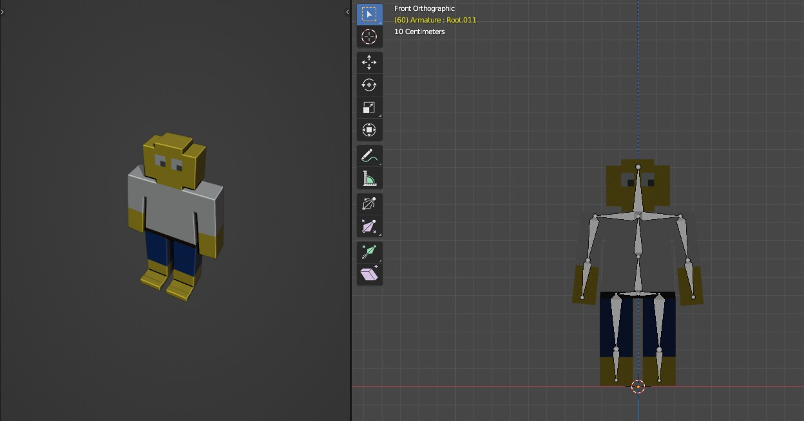

# Worksheet 2

- Nofaldi Fikrul Atmam 1906398420
- Dionisius Baskoro Samudra

## Model 1 (Green Man A.K.A Creeper)

Model manusia dengan 9 sambungan yaitu pada (Kepala-Badan, Badan-Bahu Kanan, Badan-Bahu Kiri, Bahu Kanan-Tangan Kanan, Bahu Kiri-Tangan Kiri, Badan-Betis Kanan, Badan-Betis Kiri, Betis Kiri-Kaki Kiri, Betis Kanan-Kaki Kanan)

## Model 2 (Manusia Lego)
Model dengan 10 bagian:
1. Kepala
2. Badan
3. Lengan Kanan
4. Tangan Kanan Bawah
5. Lengan Kiri
6. Tangan Kiri Bawah
7. Paha Kiri
8. Kaki Kiri
9. Paha Kanan
10. Kaki Kanan

Sepuluh bagian tersebut dihubungkan dengan 9 sendi sebagai berikut:
1. Kepala-Badan
2. Badan-Lengan Kanan
3. Badan-Lengan Kiri
4. Lengan Kanan-Tangan Kanan Bawah
5. Lengan Kiri-Tangan Kiri Bawah
6. Badan-Paha Kiri
7. Badan-Paha Kanan
8. Paha Kanan-Kaki Kanan
9. Paha Kiri-Kaki Kiri

Berikut merupakan detil dari model Lego
