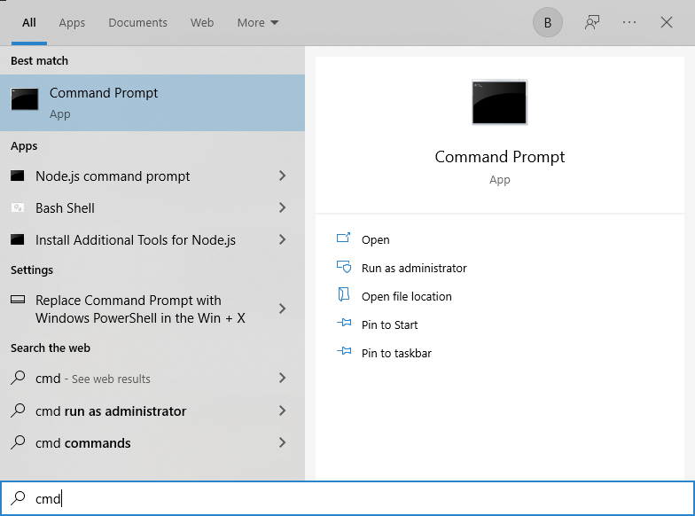
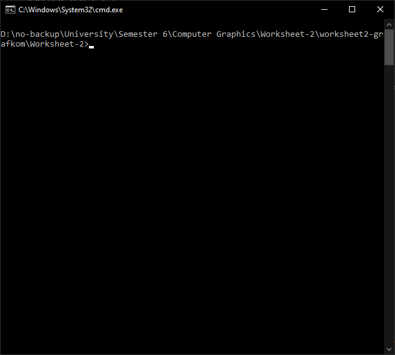
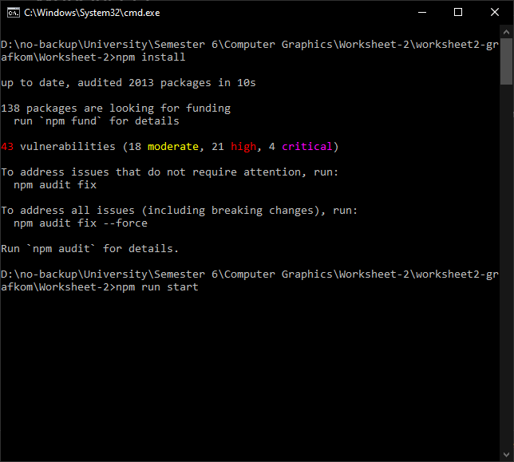
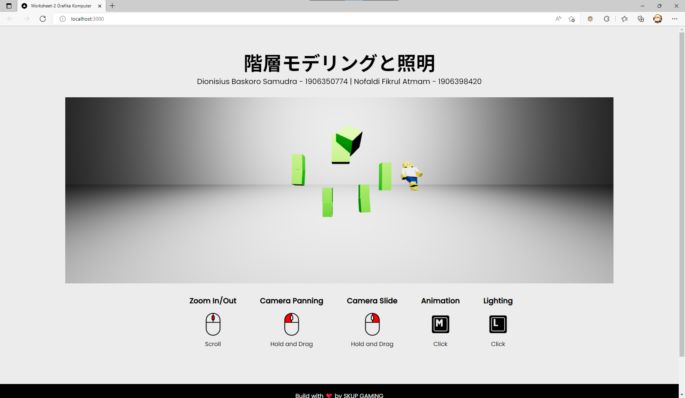
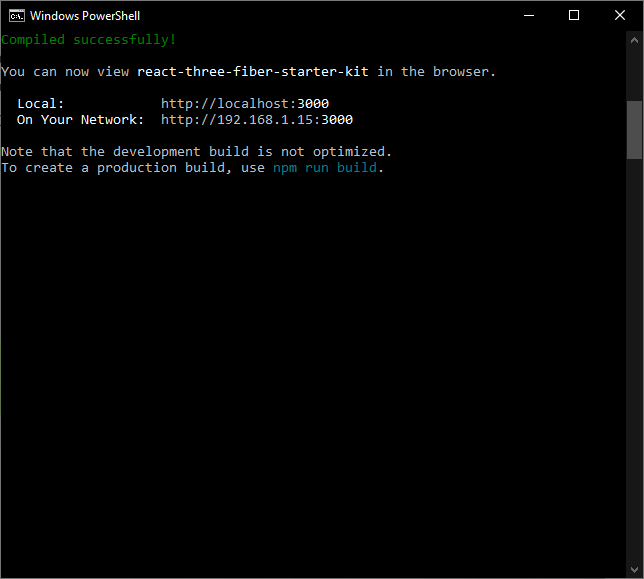
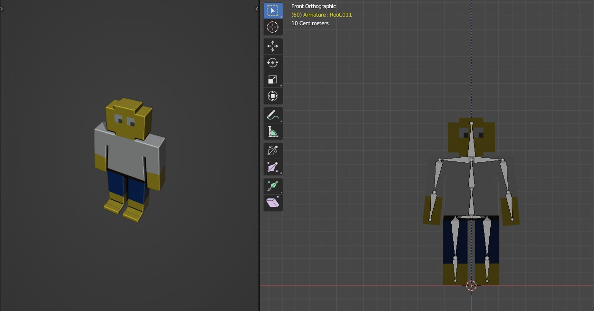

# Worksheet 2

- Nofaldi Fikrul Atmam 1906398420
- Dionisius Baskoro Samudra

## About
Program ini merupakan program **Hierarchical Modelling & Lighting**. Folder ini terdiri atas beberapa bagian:
1. Folder Blender Models
2. Folder Worksheet-2
3. Folder Documentations
4. Readme.md

Folder `Blender models` berisikan 3D model yang digunakan pada program ini.  
Folder `Documentations` berisikan dokumentasi atau gambar dari projek ini.  
Folder `Worksheet-2` berisikan program-program yang dibutuhkan untuk menjalankan projek ini.

## How To Operate
1. Buka aplikasi `command prompt` atau `terminal`  
   
2. Buka folder/directory `Worksheet-2` melalui `command prompt` atau `terminal`  
   
3. Jalankan perintah `npm install`  
    
4. Jalankan perintah `npm run start`  
   
5. Buka browser dan buka halaman `http://localhost:3000`  
   
6. Secara default, program akan menggunakan **port 3000**. Namun jika halaman tidak dapat ditemukan, periksa pada `command prompt` atau `terminal` untuk mendapatkan port yang digunakan.  
   

## Model 1 (Green Man A.K.A Creeper)

Model manusia dengan 9 sambungan yaitu pada (Kepala-Badan, Badan-Bahu Kanan, Badan-Bahu Kiri, Bahu Kanan-Tangan Kanan, Bahu Kiri-Tangan Kiri, Badan-Betis Kanan, Badan-Betis Kiri, Betis Kiri-Kaki Kiri, Betis Kanan-Kaki Kanan)

## Model 2 (Manusia Lego)
Model dengan 10 bagian:
1. Kepala
2. Badan
3. Lengan Kanan
4. Tangan Kanan Bawah
5. Lengan Kiri
6. Tangan Kiri Bawah
7. Paha Kiri
8. Kaki Kiri
9. Paha Kanan
10. Kaki Kanan

Sepuluh bagian tersebut dihubungkan dengan 9 sendi sebagai berikut:
1. Kepala-Badan
2. Badan-Lengan Kanan
3. Badan-Lengan Kiri
4. Lengan Kanan-Tangan Kanan Bawah
5. Lengan Kiri-Tangan Kiri Bawah
6. Badan-Paha Kiri
7. Badan-Paha Kanan
8. Paha Kanan-Kaki Kanan
9. Paha Kiri-Kaki Kiri

Berikut merupakan detil dari model Lego
