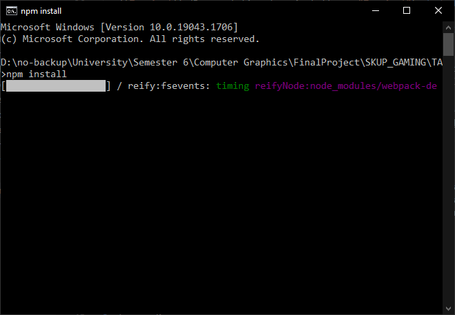

# Tugas Akhir

- Nofaldi Fikrul Atmam 1906398420
- Dionisius Baskoro Samudra 1906350774

## About

Folder ini terdiri atas beberapa bagian:

1. Folder Blender Models
2. Folder TA
3. Folder Documentations
4. Readme.md

Folder `Blender models` berisikan 3D model yang digunakan pada program ini.  
Folder `Documentations` berisikan dokumentasi atau gambar dari projek ini.  
Folder `TA` berisikan program-program yang dibutuhkan untuk menjalankan projek ini.

## How To Operate

1. Buka aplikasi `command prompt` atau `terminal`  
      
2. Buka folder/directory `Worksheet-2` melalui `command prompt` atau `terminal`  
      
3. Jalankan perintah `npm install`  
      
4. Jalankan perintah `npm run start`  
      
5. Buka browser dan buka halaman `http://localhost:3000`  
      
6. Secara default, program akan menggunakan **port 3000**. Namun jika halaman tidak dapat ditemukan, periksa pada `command prompt` atau `terminal` untuk mendapatkan port yang digunakan.  
      
7. Program juga bisa langsung di akses di link berikut: http://skupgaming.nofamex.tech/

## Model 1 (Green Man A.K.A Creeper by Nofaldi Fikrul Atamam)

Model manusia dengan 9 sambungan yaitu pada (Kepala-Badan, Badan-Bahu Kanan, Badan-Bahu Kiri, Bahu Kanan-Tangan Kanan, Bahu Kiri-Tangan Kiri, Badan-Betis Kanan, Badan-Betis Kiri, Betis Kiri-Kaki Kiri, Betis Kanan-Kaki Kanan)

## Model 2 (Manusia Lego by Dionisius Baskoro Samudra)

Model dengan 10 bagian:

1. Kepala
2. Badan
3. Lengan Kanan
4. Tangan Kanan Bawah
5. Lengan Kiri
6. Tangan Kiri Bawah
7. Paha Kiri
8. Kaki Kiri
9. Paha Kanan
10. Kaki Kanan

Sepuluh bagian tersebut dihubungkan dengan 9 sendi sebagai berikut:

1. Kepala-Badan
2. Badan-Lengan Kanan
3. Badan-Lengan Kiri
4. Lengan Kanan-Tangan Kanan Bawah
5. Lengan Kiri-Tangan Kiri Bawah
6. Badan-Paha Kiri
7. Badan-Paha Kanan
8. Paha Kanan-Kaki Kanan
9. Paha Kiri-Kaki Kiri

Berikut merupakan detil dari model Lego

## Proses Rendering Objek dan Scene

1. Membuat canvas sebagai media untuk merender model, plane dll
2. Membuat dan merender landscape komponen GroundPlane
3. Membuat dan merender background komponen BackDrop
4. Membuat dan merender camera komponen OrbitalControl, dengan memanfaatkan algoritma PerspectiveCamera, Scene
5. Membuat 3 buah lighting, dengan memanfaatkan algoritma RectAreaLight, dibuatlah 3 komponen lighting KeyLight sebagai direction light, FillLight sebagai point light dan RimLight sebagai spotlight
6. 6 buah objek yang sebelumnya sudah dibuat kemudian di render

## Algoritma Khusus Yang Digunakan

1. BoxGeometry, MeshBasicMaterial dan Mesh untuk pembentukan object dan landscape
2. OrbitalControl
3. PerspectiveCamera
4. RectAreaLight

## Log Pekerjaan

- Dionisius Baskoro Samudra:

  - Membuat model dan merendernya pada aplikasi
  - Membuat lighting, directional dan point light
  - Membuat mode wireframe dan shader
  - Membuat bayangan pada objek
  - Menulis dokumentasi
  - Membuat website jadi aesthetic

- Nofaldi Fikrul Atmam:
  - Membuat model dan merendernya pada aplikasi
  - Membuat model hierarki dapat bergerak
  - Membuat dua mode display dan interaktif
  - Menerapkan texturing pada objek
  - Membuat dokumentasi
  - Mendeploy aplikasi

## Sumber dan Referensi

- https://threejs.org/docs/#examples/en/controls/OrbitControls
- https://threejs.org/docs/#api/en/objects/Mesh
- https://docs.pmnd.rs/react-three-fiber/getting-started/introduction
- https://github.com/pmndrs/gltfjsx
- https://codesandbox.io/s/react-three-fiber-custom-geometry-with-fragment-shader-material-vxswf
- https://codesandbox.io/s/three-point-lighting-in-react-three-fiber-52bnw?file=/src/index.js
